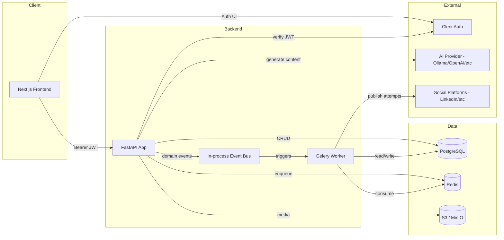
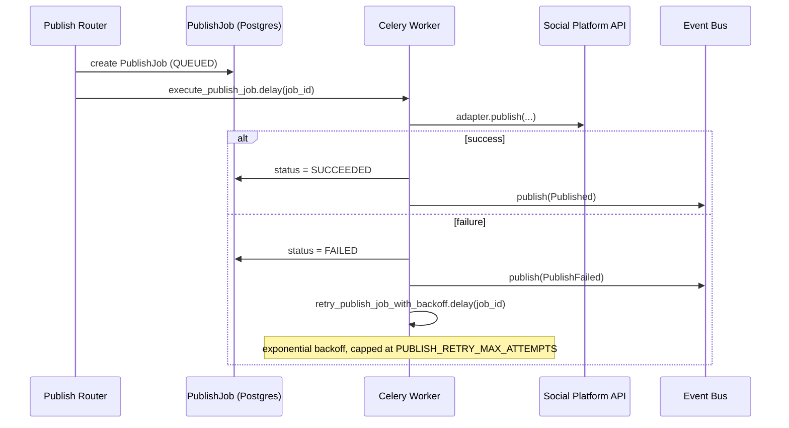
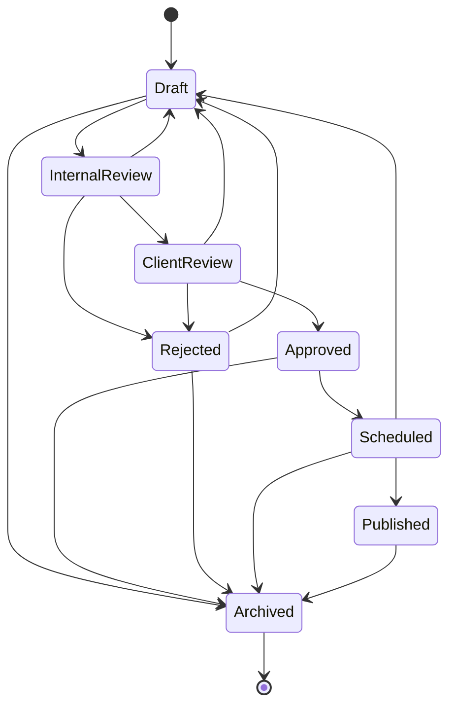

# Architecture

## Overview

The Social Media Marketing Machine is a multi-tenant SaaS platform. A
single FastAPI monolith backend serves a Next.js frontend; Celery workers
handle asynchronous/retryable work (publishing); Postgres is the system of
record; Redis is the Celery broker/backend; S3-compatible storage (MinIO
locally) holds media assets; Clerk provides authentication and
organization (tenant) management.



## Module boundaries

```
backend/app/
  models/         SQLAlchemy 2.0 ORM models (the schema, single source of truth)
  schemas/        Pydantic request/response models (API contract, never ORM objects directly)
  repositories/   Data access layer; ALL tenant-scoped repos enforce organization_id filtering
  routers/        FastAPI route handlers; thin — delegate to repositories/services
  services/       Business logic that spans multiple repositories (approval state machine, prompt templates)
  core/           Cross-cutting: config, db session, auth, exceptions
  ai/             AI provider abstraction (base.py) + factory + concrete providers
  social/         Social platform abstraction (base.py) + factory + concrete platform adapters
  events/         Domain events + in-process pub/sub bus
  workers/        Celery app + tasks (async/retryable execution, decoupled from request/response cycle)
  templates/      Jinja2 prompt templates (content, not code)
```

Each layer only depends on layers below it: routers depend on
services/repositories, services depend on repositories, repositories
depend on models. Routers never construct raw SQLAlchemy queries directly
— that discipline is what makes the org-scoping guarantee in
`repositories/base.py` meaningful (see that file's docstring for the full
rationale).

## The adapter pattern (AI + Social)

Both the AI provider layer (`app/ai/`) and the social platform layer
(`app/social/`) follow the same shape:

1. An abstract base class (`AIProvider` / `SocialPlatformAdapter`) defines
   the full capability surface with strongly-typed Pydantic request/
   response models.
2. A factory (`app/ai/factory.py` / `app/social/factory.py`) picks a
   concrete implementation based on configuration (`AI_PROVIDER` env var)
   or an explicit `Platform` enum value.
3. Exactly one concrete implementation is fully built out per layer
   (Ollama for AI, LinkedIn for social) as a reference implementation —
   chosen because they require no third-party API key/paid account,
   making the scaffold runnable and testable out of the box.
4. Every other named provider/platform is a typed stub: it satisfies the
   interface (so the factory and callers never see a different type) but
   raises `NotImplementedError` with a message telling a future developer
   exactly what env vars to set and which file to implement.

This means adding real OpenAI or Facebook support later is purely
additive — implement the stub file, no changes needed anywhere else in
the codebase (routers, workers, tests for other providers are unaffected).

## Multi-tenancy

Every tenant-scoped table has an indexed `organization_id` foreign key
(`app/models/base.py::OrgScopedMixin`). Enforcement of the tenant boundary
happens at the repository layer (`app/repositories/base.py`), not just in
routers — see that file's docstring for the defense-in-depth rationale.
Identity and organization context come from a verified Clerk JWT
(`app/core/auth.py`), decoded once per request and passed down via FastAPI
dependencies (`get_current_user`, `get_current_org`, `require_role`).

## Event-driven design

`app/events/domain_events.py` defines typed domain events (CampaignCreated,
PostGenerated, ApprovalRequested, ApprovalReceived, MediaGenerated,
Scheduled, Published, PublishFailed, AnalyticsUpdated).
`app/events/bus.py` is a lightweight in-process pub/sub dispatcher — NOT a
distributed queue. Handlers that need to survive a process restart or run
on a different worker (e.g. retrying a failed publish with backoff) hand
off to a Celery task (`app/workers/tasks/publish_tasks.py`) rather than
doing the work inline on the event-bus callback.



## Approval workflow state machine

`app/services/approval_state_machine.py` is the single place that mutates
`Post.status`. It validates every transition against an explicit table
(illegal transitions raise `InvalidTransitionError`), writes an
`AuditLog` row on every transition, and (via the routers layer) content
edits separately write `PostVersion` snapshots. See `docs/ERD.md` for how
these tables relate.



## API documentation

FastAPI auto-serves interactive OpenAPI docs once the backend is running:
- Swagger UI: `http://localhost:8000/docs`
- ReDoc: `http://localhost:8000/redoc`
- Raw schema: `http://localhost:8000/openapi.json`
