# Entity-Relationship Diagram

Generated from `backend/app/models/*.py` (22 tables). Every tenant-scoped
table carries an `organization_id` FK (omitted from most relationship
arrows below for readability, but always present — see
`app/models/base.py::OrgScopedMixin`).

```mermaid
erDiagram
    ORGANIZATIONS ||--o{ ORGANIZATION_MEMBERSHIPS : has
    USERS ||--o{ ORGANIZATION_MEMBERSHIPS : has
    ORGANIZATIONS ||--o{ TEAMS : has
    TEAMS ||--o{ TEAM_MEMBERSHIPS : has
    USERS ||--o{ TEAM_MEMBERSHIPS : has

    ORGANIZATIONS ||--o{ CLIENTS : has
    CLIENTS ||--o{ BRANDS : has
    CLIENTS ||--o{ CAMPAIGNS : has
    BRANDS ||--o{ CAMPAIGNS : "optionally scopes"
    BRANDS ||--o{ PLATFORM_ACCOUNTS : has

    CAMPAIGNS ||--o{ POSTS : contains
    CAMPAIGNS ||--o{ TASKS : "optionally has"
    USERS ||--o{ TASKS : "assigned"

    POSTS ||--o{ POST_VERSIONS : "version history"
    POSTS ||--o{ MEDIA : attaches
    POSTS ||--o{ APPROVALS : "reviewed via"
    POSTS ||--o{ COMMENTS : "discussed via"
    POSTS ||--o{ SCHEDULES : "scheduled via"
    POSTS ||--o{ PUBLISH_JOBS : "published via"
    POSTS ||--o{ ANALYTICS : "measured via"

    PLATFORM_ACCOUNTS ||--o{ SCHEDULES : "target of"
    PLATFORM_ACCOUNTS ||--o{ PUBLISH_JOBS : "target of"

    USERS ||--o{ APPROVALS : reviews
    USERS ||--o{ COMMENTS : authors
    USERS ||--o{ POST_VERSIONS : edits
    USERS ||--o{ AI_REQUESTS : requests
    USERS ||--o{ AUDIT_LOGS : "acts as"
    USERS ||--o{ NOTIFICATIONS : receives

    ORGANIZATIONS ||--o{ PROMPT_TEMPLATES : owns
    ORGANIZATIONS ||--o{ AI_REQUESTS : logs
    ORGANIZATIONS ||--o{ AUDIT_LOGS : logs
    ORGANIZATIONS ||--o{ NOTIFICATIONS : logs

    COMMENTS ||--o{ COMMENTS : "replies to (parent_comment_id)"

    ORGANIZATIONS {
        uuid id PK
        string name
        string slug UK
        string clerk_org_id UK
        bool is_active
    }
    USERS {
        uuid id PK
        string clerk_user_id UK
        string email UK
        string full_name
    }
    ORGANIZATION_MEMBERSHIPS {
        uuid id PK
        uuid organization_id FK
        uuid user_id FK
        enum role "owner|admin|member|client_viewer"
    }
    TEAMS {
        uuid id PK
        uuid organization_id FK
        string name
    }
    TEAM_MEMBERSHIPS {
        uuid id PK
        uuid team_id FK
        uuid user_id FK
    }
    CLIENTS {
        uuid id PK
        uuid organization_id FK
        string name
        bool is_active
    }
    BRANDS {
        uuid id PK
        uuid organization_id FK
        uuid client_id FK
        string name
        string voice
        string audience
        array keywords
        json brand_colors
    }
    CAMPAIGNS {
        uuid id PK
        uuid organization_id FK
        uuid client_id FK
        uuid brand_id FK
        string name
        enum status "draft|active|paused|completed|archived"
        date start_date
        date end_date
        int budget_cents
    }
    POSTS {
        uuid id PK
        uuid organization_id FK
        uuid campaign_id FK
        uuid created_by_user_id FK
        string platform
        text caption
        array hashtags
        enum status "draft|internal_review|client_review|approved|rejected|scheduled|published|archived"
    }
    POST_VERSIONS {
        uuid id PK
        uuid post_id FK
        int version_number
        text caption
        array hashtags
        uuid edited_by_user_id FK
        string change_summary
    }
    MEDIA {
        uuid id PK
        uuid organization_id FK
        uuid post_id FK
        enum media_type "image|video|gif|document"
        string storage_key
        string url
        bool ai_generated
    }
    APPROVALS {
        uuid id PK
        uuid organization_id FK
        uuid post_id FK
        uuid reviewer_user_id FK
        string stage
        enum status "pending|approved|rejected|changes_requested"
        string feedback
    }
    COMMENTS {
        uuid id PK
        uuid organization_id FK
        uuid post_id FK
        uuid author_user_id FK
        uuid parent_comment_id FK
        text body
        bool resolved
    }
    TASKS {
        uuid id PK
        uuid organization_id FK
        uuid campaign_id FK
        uuid assignee_user_id FK
        string title
        enum status "todo|in_progress|blocked|done|cancelled"
        datetime due_at
    }
    PLATFORM_ACCOUNTS {
        uuid id PK
        uuid organization_id FK
        uuid brand_id FK
        enum platform "linkedin|facebook|instagram|x|threads|tiktok|pinterest|youtube|google_business"
        string external_account_id
        string access_token
        string refresh_token
        datetime token_expires_at
    }
    SCHEDULES {
        uuid id PK
        uuid organization_id FK
        uuid post_id FK
        uuid platform_account_id FK
        datetime scheduled_at
        bool is_cancelled
    }
    PUBLISH_JOBS {
        uuid id PK
        uuid organization_id FK
        uuid post_id FK
        uuid platform_account_id FK
        enum status "queued|running|succeeded|failed|retrying|cancelled"
        int attempt_count
        int max_attempts
        string external_post_id
        datetime next_attempt_at
    }
    ANALYTICS {
        uuid id PK
        uuid organization_id FK
        uuid post_id FK
        datetime captured_at
        int impressions
        int likes
        int comments_count
        int shares
        int clicks
        numeric engagement_rate
        json raw_payload
    }
    AI_REQUESTS {
        uuid id PK
        uuid organization_id FK
        uuid requested_by_user_id FK
        string provider
        string model
        string operation
        text prompt
        text response
        int tokens_used
        numeric cost_usd
        bool succeeded
    }
    PROMPT_TEMPLATES {
        uuid id PK
        uuid organization_id FK
        string slug
        string name
        text template_body
        array variables
        int version
        bool is_active
    }
    AUDIT_LOGS {
        uuid id PK
        uuid organization_id FK
        uuid actor_user_id FK
        enum action "create|update|delete|state_transition|login|publish|other"
        string entity_type
        uuid entity_id
        json metadata_json
    }
    NOTIFICATIONS {
        uuid id PK
        uuid organization_id FK
        uuid recipient_user_id FK
        enum notification_type
        string title
        bool is_read
    }
```

## Notes on cross-dialect types

- `id` / `*_id` columns use a custom `GUID` `TypeDecorator`
  (`app/core/db_types.py`) — native `UUID` on PostgreSQL, `CHAR(36)` on
  SQLite.
- `array` fields (`keywords`, `hashtags`, `variables`) use
  `StringArrayCompat` — native `ARRAY(TEXT)` on PostgreSQL, JSON-encoded
  TEXT on SQLite.
- `json` fields (`brand_colors`, `raw_payload`, `metadata_json`) use
  `JSONBCompat` — native `JSONB` on PostgreSQL, plain `JSON` on SQLite.

This is what allows the exact same model definitions to back both the
production PostgreSQL database and the SQLite in-memory test database
(`backend/tests/conftest.py`).
